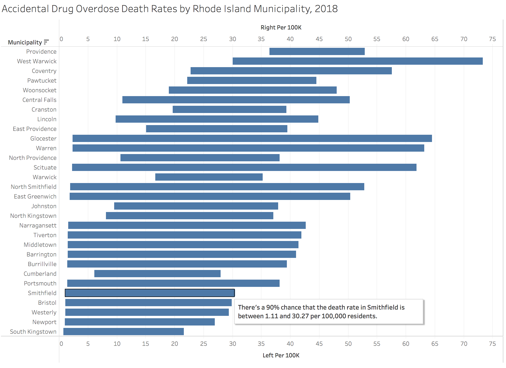

# Constructing and sorting credibility intervals in business intelligence: a demo

This repo contains a data pipeline showing how to construct and sort Bayesian
credibility intervals for binary-outcome event rates.

The result is a dashboard like the below: a sorted list of categories where the
top of the dashboard gives you the categories where you're confident of a high
event rate (left endpoints are furthest to the right), the bottom gives you the
categories where you're confident of a low event rate (right endpoints are
furthest to the left), and the middle consists of categories where there's
either insufficient data or a moderate event rate, or both. Without appreciably
more space or mental bandwidth than a bar chart, it provides decision-makers a
far more robust answer to the question, "What should I look at?"

